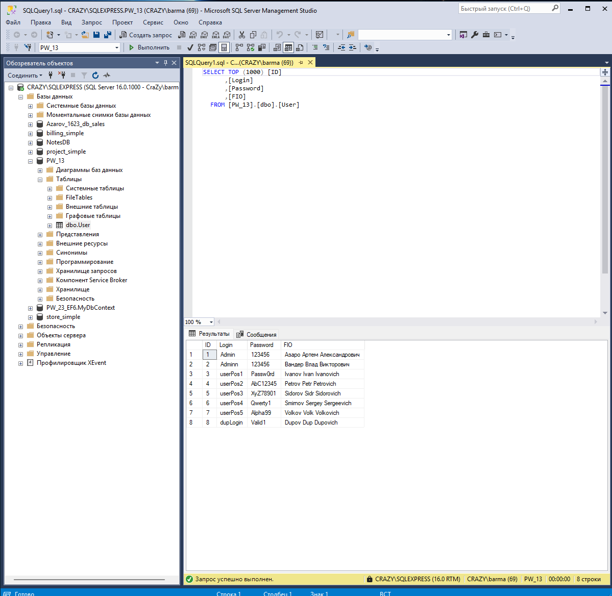
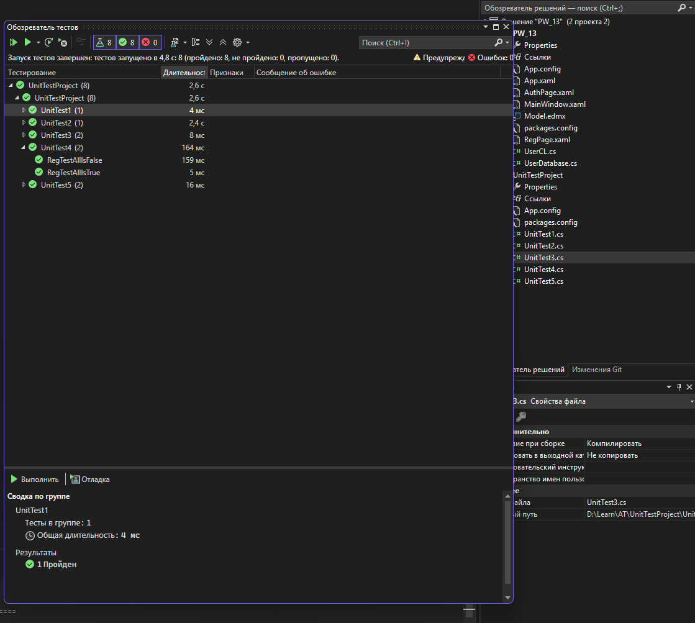

# Отчет о тестировании

## Введение

В данном проекте были реализованы тесты для классов аутентификации и регистрации пользователей. Все тесты успешно пройдены, что подтверждает корректность работы функций.

## Результаты тестирования

Все тесты прошли успешно, что свидетельствует о том, что:
- Функции аутентификации работают корректно для допустимых и недопустимых входных данных.
- Функции регистрации обрабатывают валидные и невалидные данные согласно установленным критериям.

### Основные выводы:
- Все положительные сценарии для аутентификации и регистрации были успешно выполнены.
- Все отрицательные сценарии также обработаны корректно.
- Обработка капчи работает как ожидалось.

## Скриншоты

### Скриншот содержимого таблицы с пользователями из СУБД Microsoft SQL Server

### Скриншот окна «Обозреватель тестов»

## Заключение

На основании проведенных тестов можно сделать вывод, что критические функции аутентификации и регистрации пользователей работают корректно и готовы к использованию.
